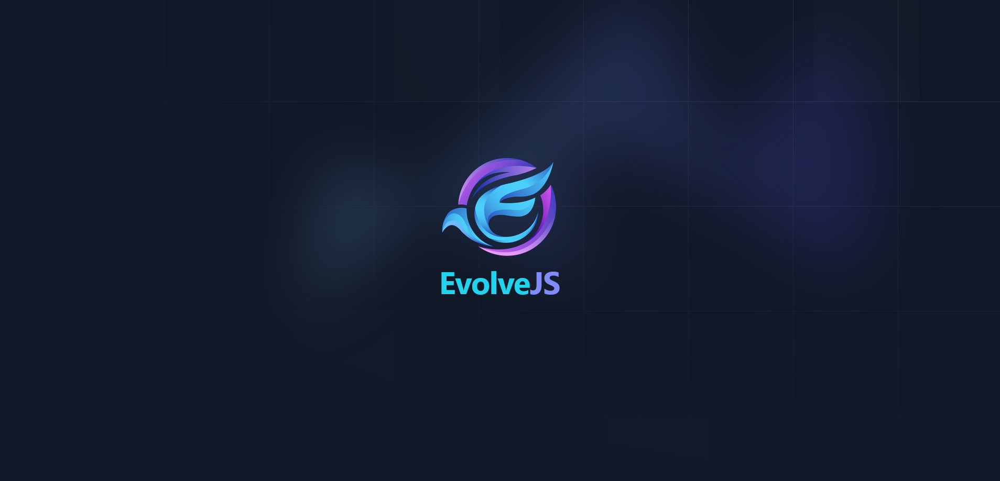

# EvolveJS

EvolveJS adalah framework JavaScript berbasis Express yang dirancang untuk memberikan kemudahan dalam pengembangan aplikasi web dengan struktur modular, multi css dan performa tinggi. Berikut adalah analisis mendalam tentang arsitektur, fitur, dan kompleksitas framework ini.

## Cara Penggunaan

#### 1. Persiapan Proyek

Untuk menggunakan EvolveJS, pastikan Anda memiliki Node.js dan npm (Node Package Manager) yang terinstal di sistem Anda. Jika belum, Anda dapat mengunduh dan menginstalnya dari Node.js.

#### 2. Instalasi

Jika Anda ingin menggunakan EvolveJS dari repositori GitHub, Anda bisa meng-clone repositorinya dengan perintah berikut:

```
git clone https://github.com/fitri-hy/evolve-js.git
cd evolve-js
```

Install dependensi yang diperlukan dengan npm:

```
npm install
```

#### 3. Menjalankan Aplikasi

Untuk menjalankan aplikasi EvolveJS, gunakan perintah berikut:

```
npm start / npm run dev

```

Untuk menjalankan aplikasi EvolveJS dengan tailwind css secara langsung, gunakan perintah berikut:

```
npm run dev:tw
```


#### 4. Struktur Proyek

Berikut adalah struktur dasar proyek EvolveJS:

```
EvolveJS/
│
├── core/
│   ├── App.js
│   ├── CSSMiddleware.js
│   ├── Middleware.js
│   └── Router.js
│
├── controllers/
│   └── HomeController.js
│
├── routes/
│   └── WebRoute.js
│
├── views/
│   ├── css.json
│   └── pages/
│       ├── index.ejs
│       └── 404.ejs
│
├── public/
│   └── (static files, if any)
│
├── .gitignore
├── package.json
├── postcss.config.js
├── tailwind.config.js
└── README.md
```

## Struktur Proyek

Framework ini menggunakan struktur proyek yang terorganisir dengan baik, memisahkan berbagai komponen fungsionalnya ke dalam folder yang sesuai:

 - core/: Mengandung komponen inti seperti konfigurasi aplikasi, middleware, dan router.
 - controllers/: Menyimpan controller yang mengatur logika aplikasi dan interaksi dengan tampilan.
 - routes/: Berisi definisi rute aplikasi.
 - views/: Menyimpan template EJS dan konfigurasi CSS.
 - public/: Untuk file statis yang diakses oleh klien, seperti CSS dan gambar.

## Komponen Utama

#### 1. Controller

File: controllers/HomeController.js
```
class HomeController {
  static index(req, res) {
    res.render('pages/index', { message: 'Hello from HomeController!' });
  }
}

export default HomeController;
```

Deksripsi:

- Fungsi: Mengatur logika untuk menampilkan halaman beranda (index) dengan pesan.
- Keunggulan: Metode index bersifat statis dan sederhana, memudahkan pengelolaan rute terkait halaman beranda.

#### 2. App Configuration

File: core/App.js
```
import express from 'express';
import path from 'path';
import { fileURLToPath } from 'url';
import Router from './Router.js';
import Middleware from './Middleware.js';
import getCSSMiddleware from './CSSMiddleware.js';
import WebRoute from '../routes/WebRoute.js';

const __filename = fileURLToPath(import.meta.url);
const __dirname = path.dirname(__filename);

class App {
  constructor() {
    this.app = express();
    this.router = new Router();
    this.setup();
  }

  setup() {
    this.app.use(express.json());
    this.app.set('view engine', 'ejs');
    this.app.set('views', path.join(__dirname, '../views'));
    this.app.use(express.static(path.join(__dirname, '../public')));
    this.app.use(getCSSMiddleware());
    this.app.use(Middleware.logRequests);
    this.app.use(Middleware.addHeader);

    this.router.addRoute('get', '/', WebRoute);
    
    this.app.use(this.router.getRouter());
    this.app.use((req, res, next) => {
      res.status(404).render('pages/404', { title: 'Page Not Found' });
    });
  }

  start(port = 3000) {
    this.app.listen(port, () => {
      console.log(`Server running on port ${port}`);
    });
  }

  use(middleware) {
    this.app.use(middleware);
    return this;
  }

  get(route, handler) {
    this.router.addRoute('get', route, handler);
    return this;
  }

  post(route, handler) {
    this.router.addRoute('post', route, handler);
    return this;
  }
}

export default App;
```

Deksripsi:

- Fungsi: Mengonfigurasi aplikasi Express, termasuk pengaturan middleware, router, dan pengelolaan rute.
- Keunggulan: Fleksibel dan dapat disesuaikan dengan mudah untuk berbagai kebutuhan aplikasi.
- Kompleksitas: Penggunaan class dan metode untuk menambahkan middleware dan rute membuat pengelolaan aplikasi menjadi terstruktur dan modular.

#### 3. CSS Middleware

File: core/CSSMiddleware.js
```
import fs from 'fs';
import path from 'path';
import { fileURLToPath } from 'url';

const __filename = fileURLToPath(import.meta.url);
const __dirname = path.dirname(__filename);

const getCSSMiddleware = () => {
  return (req, res, next) => {
    const configPath = path.join(__dirname, '../views/css.json');
    let config;

    try {
      config = JSON.parse(fs.readFileSync(configPath, 'utf8'));
    } catch (error) {
      config = { cssFramework: 'tailwind', cssSource: 'cdn' };
    }

    if (config.cssFramework === 'bootstrap') {
      res.locals.cssFile = config.cssSource === 'cdn'
        ? '<link href="https://cdn.jsdelivr.net/npm/bootstrap@5.3.3/dist/css/bootstrap.min.css" rel="stylesheet" integrity="sha384-QWTKZyjpPEjISv5WaRU9OFeRpok6YctnYmDr5pNlyT2bRjXh0JMhjY6hW+ALEwIH" crossorigin="anonymous">'
        : '<link href="/bootstrap-5.3.3/css/bootstrap.min.css" rel="stylesheet">';
    } else if (config.cssFramework === 'tailwind') {
      res.locals.cssFile = config.cssSource === 'cdn'
        ? '<script src="https://cdn.tailwindcss.com"></script>'
        : '<link href="/tailwind-3.4.10/css/tailwind.min.css" rel="stylesheet">';
    }

    next();
  };
};

export default getCSSMiddleware;
```

Deksripsi:

- Fungsi: Menyediakan middleware untuk memilih dan menyertakan CSS framework berdasarkan konfigurasi.
- Keunggulan: Memudahkan pengelolaan dan perubahan framework CSS antara Bootstrap dan Tailwind tanpa mengubah kode aplikasi.
- Kompleksitas: Menggunakan file konfigurasi JSON untuk menentukan CSS framework yang digunakan, membuat sistem menjadi fleksibel.

#### 4. Middleware

File: core/Middleware.js

```
class Middleware {
  static logRequests(req, res, next) {
    console.log(`[${new Date().toISOString()}] ${req.method} ${req.url}`);
    next();
  }

  static addHeader(req, res, next) {
    res.setHeader('X-Custom-Header', 'MyCustomHeaderValue');
    next();
  }
}

export default Middleware;
```

Deksripsi:

- Fungsi: Menyediakan middleware untuk logging request dan menambahkan header kustom.
- Keunggulan: Mempermudah penambahan fungsionalitas tambahan seperti logging dan header kustom tanpa mengubah kode aplikasi utama.
- Kompleksitas: Middleware bersifat statis dan sederhana, cocok untuk fungsi-fungsi umum dalam pengembangan aplikasi.

#### 5. Router

File: core/Router.js

```
import express from 'express';

class Router {
  constructor() {
    this.router = express.Router();
  }

  addRoute(method, path, handler) {
    this.router[method](path, handler);
    return this;
  }

  getRouter() {
    return this.router;
  }
}

export default Router;
```

Deksripsi:

- Fungsi: Menyediakan wrapper untuk routing dengan Express, memungkinkan penambahan rute berdasarkan metode HTTP.
- Keunggulan: Menyederhanakan pengelolaan rute dan memisahkan logika routing dari aplikasi utama.
- Kompleksitas: Struktur yang bersih dan mudah digunakan, memudahkan pengelolaan berbagai rute.

#### 6. Routes

File: routes/WebRoute.js

```
import express from 'express';
import HomeController from '../controllers/HomeController.js';

const router = express.Router();

router.get('/', HomeController.index);

export default router;
```

Deksripsi:

- Fungsi: Mendefinisikan rute untuk aplikasi, dalam hal ini, mengarahkan permintaan GET ke halaman beranda ke HomeController.
- Keunggulan: Memisahkan rute dari logika controller, memungkinkan pengelolaan rute yang lebih mudah dan terorganisir.
- Kompleksitas: Struktur yang sederhana dan langsung, sesuai untuk aplikasi dengan beberapa rute.

7. CSS Configuration

File: views/css.json

```
{
  "_note_": "cssFramework = change bootstrap or tailwind | cssSource = change cdn or local",
  "cssFramework": "tailwind",
  "cssSource": "local"
}
```

Deksripsi:

- Fungsi: Menyimpan konfigurasi untuk framework CSS yang digunakan.
- Keunggulan: Memudahkan perubahan framework CSS dengan mengubah file konfigurasi tanpa mengubah kode aplikasi.
- Kompleksitas: Konfigurasi JSON sederhana, mudah untuk diubah dan diperluas jika diperlukan. 


EvolveJS adalah framework yang dirancang dengan prinsip modularitas dan fleksibilitas. Dengan memisahkan berbagai komponen seperti controller, middleware, dan router, serta menyediakan konfigurasi yang mudah diubah, EvolveJS memudahkan pengembangan aplikasi web yang efisien dan terstruktur. Framework ini menawarkan performa yang baik dan struktur yang jelas, memungkinkan pengembang untuk membangun aplikasi dengan cepat dan mudah.